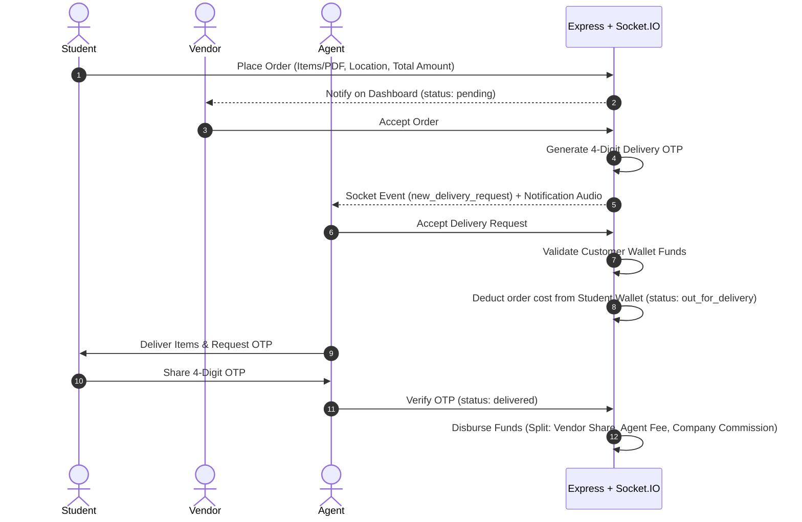

# 🛒 CampusKart

**CampusKart** is a premium, real-time, on-demand campus delivery platform. It enables students to purchase stationery, café items, and order prints (with direct PDF upload and custom formatting parameters) to be delivered directly to their current campus location (e.g., specific hostel blocks or classrooms). The platform integrates students, campus vendors, delivery agents, and system administrators into a unified, zero-cash ecosystem powered by real-time updates and wallet-based transactions.

Link to website: [CampusKart](https://campuskart-pshe.onrender.com)

---

## 👥 Platform Roles & Capabilities

### 1. 🎓 Student (User)
* **Shop & Order:** Browse products categorized by campus vendors, manage a shopping cart, and place orders.
* **On-Demand Printing:** Upload PDFs for print orders, selecting specific options (Color vs. Black & White, Single/Double-sided, page counts, and copies) with automated price calculations.
* **Wallet Ecosystem:** Pay securely through a digital wallet. Receive funds (credited by the Admin) and view transaction logs.
* **Order Tracking:** Track orders through a real-time status tracker, complete with a secure 4-digit **Delivery OTP** used to confirm successful package handovers.

### 2. 🏪 Campus Vendor
* **Store Profile Management:** Define and modify store names and operational locations.
* **Product Catalog Management:** List, edit, and delete products, including setting prices, descriptions, and custom item images.
* **Order Management:** Real-time dashboard for incoming orders, allowing vendors to accept or reject student requests.
* **Earnings Wallet:** Receive direct vendor-share payouts automatically into their store wallet upon successful deliveries.

### 3. 🚴 Delivery Agent
* **Zone Selection:** Select specific campus locations (or "All") as active delivery zones to filter requests.
* **Real-Time Dispatch:** Receive instant, audio-notified delivery request alerts for pending orders in their active zone.
* **Transit Workflow:** Claim orders, execute a secure digital checkout that checks student wallet balances, transit items, and complete deliveries by inputting the customer's 4-digit OTP.
* **Agent Earnings:** Earn a delivery commission per order, automatically deposited into their agent wallet upon delivery verification.

### 4. 🔑 Platform Administrator (Admin)
* **User Approvals:** Approve or reject registrations for new vendors and delivery agents to maintain security.
* **Logistics & Locations:** Add, list, and delete active delivery zones and hostels on campus.
* **Financial Controls:** Configure platform commission rates, view system earnings, and search/add funds directly to any user's wallet.
* **Analytics Dashboard:** Monitor real-time charts (daily/weekly/monthly/yearly revenue, net sales, and volumes) powered by Recharts.
* **System Controls:** Perform administrative resets to wipe transactions, orders, and products for new term cycles.

---

## ⚙️ Platform Architecture

### Tech Stack
* **Frontend:** React, Vite, TailwindCSS (for sleek, responsive UI), Lucide Icons, Recharts (for admin visualization), and Socket.IO client.
* **Backend:** Node.js, Express, MongoDB (Mongoose ODM), and Socket.IO server.
* **File Hosting:** Cloudinary (for product images and print PDF storage).
* **Deployment:** Pre-configured for Render single-instance hosting.

---

## 🔄 Order & Delivery Lifecycle



1. **Placement:** A student compiles a cart or uploads a print file, chooses a delivery location, and places an order. The order starts in `pending` status.
2. **Vendor Approval:** The vendor reviews and clicks **Accept**. The backend generates a secure 4-digit **Delivery OTP** and transitions the order status to `accepted` (visible to the student as `processing`).
3. **Dispatch Notification:** Via Socket.IO, agents listening to the target delivery location (or "All") receive a `new_delivery_request` socket event alongside an interactive audio sound alert.
4. **Locking & Escrow:** An agent requests to deliver the order. The system validates the student's wallet balance. Upon validation, the total order amount is debited from the student's wallet, and the order is marked `out_for_delivery`.
5. **Handover & Disbursal:** Upon physical arrival, the agent inputs the student's OTP. If the OTP matches, the status marks as `delivered`, and the backend splits the escrowed funds:
   * **Vendor:** Receives the cost of the items.
   * **Agent:** Receives their delivery fee.
   * **Company:** Receives the platform service commission.

---

## 📦 Setting Up Locally

### Prerequisites
* Node.js (v18+)
* MongoDB (Local Instance or Atlas URI)
* Cloudinary API Credentials (optional, for image/PDF upload capability)

### 1. Environment Configuration
Create a `.env` file in the [server/](file:///Users/panavpatel/Panav's Workspace/Projects/Project CampusKart/CampusKart_final/server) directory:
```env
PORT=5001
MONGO_URI=mongodb://localhost:27017/campuskart
JWT_SECRET=your_jwt_secret_key
CLOUDINARY_CLOUD_NAME=your_cloudinary_name
CLOUDINARY_API_KEY=your_api_key
CLOUDINARY_API_SECRET=your_api_secret
```

### 2. Dependency Installation
Run the following from the root project directory:
```bash
# Install root, client, and server dependencies
npm install
npm install --prefix client
npm install --prefix server
```

### 3. Running the App
```bash
# Launch both backend server and frontend client concurrently
npm run dev
```
* **Frontend URL:** `http://localhost:5173`
* **Backend API / Socket URL:** `http://localhost:5001`

---

## 🔧 Developer & Maintenance Scripts
The platform includes several backend CLI utilities located in the [server/](file:///Users/panavpatel/Panav's Workspace/Projects/Project CampusKart/CampusKart_final/server) directory:

* **[repair_admin.js](file:///Users/panavpatel/Panav's Workspace/Projects/Project CampusKart/CampusKart_final/server/repair_admin.js):** Resets or seeds admin credentials to standard testing defaults:
  * **Admin Email:** `admin@campuskart.com` (or `admin_new@campuskart.com`)
  * **Password:** `admin123`
  ```bash
  node server/repair_admin.js
  ```
* **[check_admin.js](file:///Users/panavpatel/Panav's Workspace/Projects/Project CampusKart/CampusKart_final/server/check_admin.js):** Lists all administrative accounts currently saved in the database along with approval states.
* **[verify_socket.js](file:///Users/panavpatel/Panav's Workspace/Projects/Project CampusKart/CampusKart_final/server/verify_socket.js):** Mock-runs the Socket.IO dispatch flow to confirm real-time zone routing and audio notification readiness.
* **[verify_full_system.js](file:///Users/panavpatel/Panav's Workspace/Projects/Project CampusKart/CampusKart_final/server/verify_full_system.js):** Conducts end-to-end integration tests of order processing, wallet deductions, and commission disbursement logic.